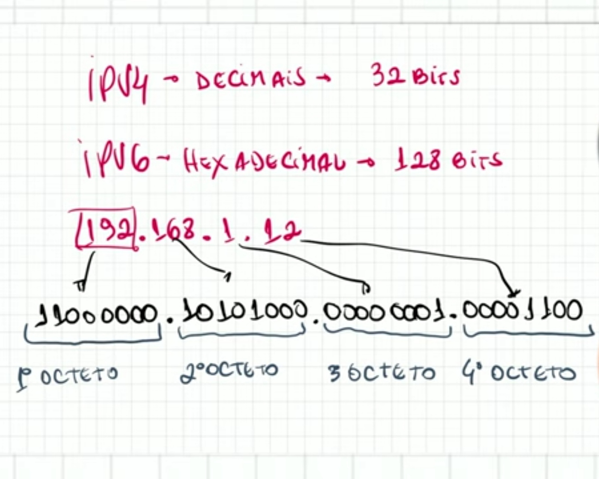

```Bash
███╗   ██╗███████╗████████╗    ██████╗ ██████╗  █████╗ ████████╗██╗ ██████╗███████╗
████╗  ██║██╔════╝╚══██╔══╝    ██╔══██╗██╔══██╗██╔══██╗╚══██╔══╝██║██╔════╝██╔════╝
██╔██╗ ██║█████╗     ██║       ██████╔╝██████╔╝███████║   ██║   ██║██║     █████╗  
██║╚██╗██║██╔══╝     ██║       ██╔═══╝ ██╔══██╗██╔══██║   ██║   ██║██║     ██╔══╝  
██║ ╚████║███████╗   ██║       ██║     ██║  ██║██║  ██║   ██║   ██║╚██████╗███████╗
╚═╝  ╚═══╝╚══════╝   ╚═╝       ╚═╝     ╚═╝  ╚═╝╚═╝  ╚═╝   ╚═╝   ╚═╝ ╚═════╝╚══════╝                                                                
```
*This project is a general practical exercise to let you discover networking..*

 Skills | Grade |
:------:|:-----:|
[**Network & system administration**] [**Rigor**] | **Subscribed :atom:**
<!-- **:white_check_mark: 100%** -->

<!-- * ### [Introduction]() -->
* ### [Mandatory part](#mandatory-part-1)
<!-- * ### [Mind Map](#mind-map-1) -->
<!-- * ### [Overview](#overview-1) -->
<!-- * ### [Usage]() -->
* ### [Study resources](#study-resources-1)
<!-- * ### [Tools]() -->
<!-- * ### [Workflow]() -->

## Mandatory part
- Para completar esta tarefa, é altamente recomendável entender como funciona o endereçamento em uma \
rede na qual existem dispositivos como roteadores. Leia sobre endereçamento TCP/IP.

[↑ Index ↑](#mandatory-part)

## Tools
<!-- [](./dcs/img/IMG_20240216_152557.jpg) -->

## Study resources
### Links
- [tutorial ipaube](https://github.com/lpaube/NetPractice)
- [tutorial viruskizz](https://github.com/viruskizz/42bangkok-netpractice)
- [tutorial ricardoneves](https://github.com/ricardoreves/42-net-practice)
- [medium @imzf](https://medium.com/@imyzf/netpractice-2d2b39b6cf0a)
- [medium toufa7 Subneting](https://toufa7.medium.com/new-subnetting-34fadfb86c70)
- [medium toufa7 Guidelines](https://toufa7.medium.com/netpractice-guidelines-6341b8309f38)
- [curso em video](https://www.youtube.com/playlist?list=PLAp37wMSBouCU49LV0qFbItufigjYk-sp)

[↑ Index ↑](#mandatory-part)

## Workflow
<details>

## Levels
- [x] Level 1
- [x] Level 2
- [x] Level 3
- [x] Level 4
- [x] Level 5
- [x] Level 6
- [x] Level 7
- [x] Level 8
- [x] Level 9
- [x] Level 10

### Subnet Mask (Máscara de subrede)
- A máscara de subrede é um número de 32 bits que serve para separar a parte da rede da parte do host.

|Subnet Mask 	|CIDR |	Binary Notation| 	Network Bits| 	Host Bits| 	Available Addresses|
| -           | -   | -              | -            | -          | -                   | 
|255.255.255.255| 	/32| 	11111111.11111111.11111111.11111111| 	32| 	0| 	1|
|255.255.255.254| 	/31| 	11111111.11111111.11111111.11111110| 	31| 	1| 	2|
|255.255.255.252| 	/30| 	11111111.11111111.11111111.11111100| 	30| 	2| 	4|
|255.255.255.248| 	/29| 	11111111.11111111.11111111.11111000| 	29| 	3| 	8|
|255.255.255.240| 	/28| 	11111111.11111111.11111111.11110000| 	28| 	4| 	16|
|255.255.255.224| 	/27| 	11111111.11111111.11111111.11100000| 	27| 	5| 	32|
|255.255.255.192| 	/26| 	11111111.11111111.11111111.11000000| 	26| 	6| 	64|
|255.255.255.128| 	/25|     11111111.11111111.11111111.10000000| 	25| 	7| 	128|
|255.255.255.0| 	/24| 	11111111.11111111.11111111.00000000| 	24| 	8| 	256|		
|255.255.254.0| 	/23| 	11111111.11111111.11111110.00000000| 	23| 	9| 	512|
|255.255.252.0| 	/22| 	11111111.11111111.11111100.00000000| 	22| 	10| 	1024|
|255.255.248.0| 	/21| 	11111111.11111111.11111000.00000000| 	21| 	11| 	2048|
|255.255.240.0| 	/20| 	11111111.11111111.11110000.00000000| 	20| 	12| 	4096|
|255.255.224.0| 	/19| 	11111111.11111111.11100000.00000000| 	19| 	13| 	8192|
|255.255.192.0| 	/18| 	11111111.11111111.11000000.00000000| 	18| 	14| 	16384|
|255.255.128.0| 	/17| 	11111111.11111111.10000000.00000000| 	17| 	15| 	32768|
|255.255.0.0| 	/16| 	11111111.11111111.00000000.00000000| 	16| 	16| 	65536|	
|255.254.0.0| 	/15| 	11111111.11111110.00000000.00000000| 	15| 	17| 	131072|
|255.252.0.0| 	/14| 	11111111.11111100.00000000.00000000| 	14| 	18| 	262144|
|255.248.0.0| 	/13| 	11111111.11111000.00000000.00000000| 	13| 	19| 	524288|
|255.240.0.0| 	/12| 	11111111.11110000.00000000.00000000| 	12| 	20| 	1048576|
|255.224.0.0| 	/11| 	11111111.11100000.00000000.00000000| 	11| 	21| 	2097152|
|255.192.0.0| 	/10| 	11111111.11000000.00000000.00000000| 	10| 	22| 	4194304|
|255.128.0.0| 	/9| 	11111111.10000000.00000000.00000000| 	9| 	23| 	8388608|
|255.0.0.0| 	    /8| 	11111111.00000000.00000000.00000000| 	8| 	24| 	16777216| 

  <summary>Click to expand</summary>